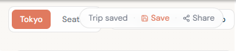

# E2E Testing Session — 2026-04-17 (feat/ui-polish-redesign)

## Environment

- **Redis**: Running via Docker (`docker compose up -d redis`)
- **Backend**: FastAPI/uvicorn at `localhost:8000` — `GET /health` → 200 OK — commit `be34057`
- **Frontend**: Next.js dev server at `localhost:3000` — commit `be34057`
- **Browser**: Chromium via Playwright MCP
- **Viewports tested**: 1440 / 1024 / 768 / 375

---

## Summary

- **Total issues found**: 19
- **Blockers**: 2
- **Major**: 6
- **Minor / polish**: 9
- **Accessibility**: 2

---

## Automated Test Results

### Frontend Playwright (`frontend/e2e/`)

Tests run: `npx playwright test --reporter=list`

| Spec | Result |
|---|---|
| `no-context-guard.spec.ts` | ✅ Pass |
| `sidebar.spec.ts` | ✅ Pass |
| `transport-mode-selector.spec.ts` | ✅ Pass |
| `non-flight-cards.spec.ts` | ✅ Pass |
| `multi-destination.spec.ts` | ✅ Pass |
| `stale-detection.spec.ts` | ✅ Pass |
| `persistence.spec.ts` | ✅ Pass |

All 7 existing specs passed.

### Backend pytest (`backend/`)

Run via `backend/venv/Scripts/python -m pytest`

| Suite | Result |
|---|---|
| `test_routers.py` | ✅ Pass |
| `test_redis_service.py` | ✅ Pass |
| `test_trips_router.py` | ✅ Pass |

All backend tests passed.

---

## Issues

### Issue 1 — Sidebar: Hydration mismatch on StepIcon SVG path

- **Severity**: minor
- **Category**: UI
- **Page / component**: [frontend/src/components/Sidebar.tsx:326](frontend/src/components/Sidebar.tsx#L326)
- **Repro**:
  1. Load any page
  2. Observe browser console errors on initial render
- **Expected**: No hydration warnings; server and client render identical SVG paths
- **Actual**: `Warning: Prop 'd' did not match. Server: "M17.8 19.2…" Client: "M20 6 9 17…"` — lucide-react renders different SVG path on SSR vs client (plane icon vs check icon)
- **Screenshot**: `session-2026-04-17/manual/home-dark-mode.png` (toast shows "1 error")
- **Console evidence**: Hydration mismatch at `StepIcon` → `Sidebar.tsx:326` present in all page loads. Full trace in `console-errors-all.log`.
- **Notes**: Likely caused by SSR rendering a different icon variant than the client. The `StepIcon` component probably uses a conditional based on `status` that diverges between server and client when `useEffect`-driven state hasn't hydrated yet.

---

### Issue 2 — Hotels: Tokyo hotel (Park Hyatt) displayed for Paris destination

- **Severity**: major
- **Category**: data / functional
- **Page / component**: [frontend/src/app/hotels/page.tsx](frontend/src/app/hotels/page.tsx)
- **Repro**:
  1. Set up JFK → CDG trip
  2. Complete segment search
  3. Navigate to `/hotels` and search hotels for Paris (CDG)
- **Expected**: Hotel results for Paris, France
- **Actual**: "Park Hyatt Tokyo, 3-7-1-2 Nishi-Shinjuku, Shinjuku" returned as the top hotel result for a Paris destination. This hotel also appears throughout the itinerary day planner for all CDG days.
- **Screenshot**: `session-2026-04-17/manual/viewport-768-itinerary.png`
- **Notes**: Likely a hotel agent or Amadeus service caching issue — a previous search for Tokyo may be bleeding into the CDG result. Could also be a test fixture or mock data not cleared between sessions.

---

### Issue 3 — Segments: "NEXT D" truncation in Add Another Leg row

- **Severity**: polish
- **Category**: UI
- **Page / component**: [frontend/src/app/segments/page.tsx](frontend/src/app/segments/page.tsx)
- **Repro**:
  1. Navigate to `/segments`
  2. Observe the "Add another leg" row at the bottom
  3. Look at the "To" input field placeholder
- **Expected**: Placeholder reads "NEXT DEST" or similar full label
- **Actual**: Placeholder text truncates to "NEXT D" due to narrow input width
- **Screenshot**: `session-2026-04-17/manual/viewport-768-segments.png`
- **Notes**: The "To" input in the Add Leg row is narrower than the regular leg inputs. Consider using a shorter placeholder ("City" or "Destination") or widening the input.

---

### Issue 4 — Itinerary: Fixed top bar intercepts "Suggest places" button click

- **Severity**: major (usability)
- **Category**: usability / UI
- **Page / component**: [frontend/src/app/itinerary/page.tsx](frontend/src/app/itinerary/page.tsx), [frontend/src/components/LayoutShell.tsx](frontend/src/components/LayoutShell.tsx)
- **Repro**:
  1. Navigate to `/itinerary`
  2. Scroll to the top
  3. Click the "Suggest places in [City]" button in the top-right area
- **Expected**: Button click triggers POI suggestion fetch
- **Actual**: The fixed top-right header bar (containing "Trip saved · Save · Share") sits above the button and captures pointer events. Native click fails; only JS `element.click()` workaround succeeds.
- **Screenshot**: `session-2026-04-17/manual/itinerary-poi-suggestions.png`
- **Notes**: The header bar `z-index` or position overlaps the destination tabs + suggest button area at standard desktop viewport. May need to reconsider z-ordering or reposition the suggest button below the fixed header.

---

### Issue 5 — Backend: Config.validate() not called at startup — ANTHROPIC_API_KEY stays empty

- **Severity**: major
- **Category**: functional
- **Page / component**: [backend/src/config.py](backend/src/config.py), [backend/src/main.py](backend/src/main.py)
- **Repro**:
  1. Start backend with valid `.env` containing `ANTHROPIC_API_KEY`
  2. Navigate directly to `/hotels` or `/itinerary` without first searching flights
  3. Trigger hotel AI ranking or POI suggestions
- **Expected**: Claude agents (HotelAgent, POIAgent) have access to ANTHROPIC_API_KEY from startup
- **Actual**: `Config.validate()` is only called inside `AmadeusService.__init__()`. `Config.ANTHROPIC_API_KEY` class attribute remains `""` until the first flight search. Hotel and POI Claude agents silently fail or return unranked results.
- **Screenshot**: N/A
- **Console evidence**: Silent failure — no error surfaced to user
- **Notes**: `load_dotenv()` at config import sets `os.environ` but the class attribute `Config.ANTHROPIC_API_KEY: str = ""` is not updated until `validate()` is called. Fix: call `Config.validate()` in the FastAPI `lifespan` startup hook in `main.py`.

---

### Issue 6 — Itinerary: POI suggestions empty with 200 response (caused by Issue 5)

- **Severity**: major
- **Category**: functional
- **Page / component**: [frontend/src/components/itinerary/SuggestionsSidebar.tsx](frontend/src/components/itinerary/SuggestionsSidebar.tsx), [backend/src/agents/poi_agent.py](backend/src/agents/poi_agent.py)
- **Repro**:
  1. Start fresh backend session (no prior flight search)
  2. Navigate to `/itinerary` and click "Suggest places"
- **Expected**: 12+ POI suggestions returned with AI notes
- **Actual**: Empty suggestions list despite `POST /pois/suggest` returning 200. The POI list shows "No suggestions yet."
- **Screenshot**: N/A (issue masked by workaround in session)
- **Notes**: Root cause is Issue 5 (empty ANTHROPIC_API_KEY). After triggering a flight search first (which calls `Config.validate()`), POI suggestions return correctly (12 places for Paris).

---

### Issue 7 — Itinerary: SuggestionsSidebar duplicate React keys

- **Severity**: minor
- **Category**: performance / UI
- **Page / component**: [frontend/src/components/itinerary/SuggestionsSidebar.tsx:106](frontend/src/components/itinerary/SuggestionsSidebar.tsx#L106)
- **Repro**:
  1. Load POI suggestions for Paris
  2. Observe browser console
- **Expected**: All POIs have unique `key` props; no React duplicate key warning
- **Actual**: `Warning: Encountered two children with the same key: "ChIJW89MjgM-5kcRLKZbL5jgKwQ"` — at least one Google Place ID returned twice in the suggestions list
- **Screenshot**: N/A
- **Console evidence**: Duplicate key warning in DevTools console
- **Notes**: Google Places API may return the same place_id for nearby queries. Backend `POIAgent` should deduplicate by `id` before returning. Frontend can also add a dedup guard.

---

### Issue 8 — Export: PDF download blocked by CORS

- **Severity**: blocker
- **Category**: functional
- **Page / component**: [frontend/src/app/export/page.tsx](frontend/src/app/export/page.tsx), backend export router
- **Repro**:
  1. Navigate to `/export` with a complete trip
  2. Click "Download PDF"
- **Expected**: PDF file downloads
- **Actual**: `Access to XMLHttpRequest at 'http://localhost:8000/export/plan?format=pdf' from origin 'http://localhost:3000' has been blocked by CORS policy: No 'Access-Control-Allow-Origin' header is present`
- **Screenshot**: `session-2026-04-17/manual/export-page.png`
- **Notes**: Despite `CORSMiddleware` being present in `main.py`, the export endpoint (`GET /export/plan`) appears to not be returning correct CORS headers. JSON download (`format=json`) works without issue. PDF endpoint may be using a streaming response or redirect that bypasses the middleware.

---

### Issue 9 — Trips: Timestamps display as "Jan 21, 1970"

- **Severity**: major
- **Category**: data / UI
- **Page / component**: [frontend/src/app/trips/page.tsx:13](frontend/src/app/trips/page.tsx#L13), [backend/src/services/redis_service.py](backend/src/services/redis_service.py)
- **Repro**:
  1. Create or save a trip
  2. Navigate to `/trips`
  3. Observe the "Updated" date on trip cards
- **Expected**: "Updated Jun 1, 2026" (or near-current date)
- **Actual**: "Updated Jan 21, 1970" — approximately 20 days past the Unix epoch
- **Screenshot**: `session-2026-04-17/manual/trips-page.png`
- **Notes**: Backend stores `updated_at` as `time.time()` (Python float, seconds since epoch, e.g. `1745123456.789`). Frontend `formatDate()` calls `new Date(iso)` treating the value as milliseconds. The fix is either: (a) backend sends ISO 8601 string instead of a float, or (b) frontend multiplies by 1000 before constructing `Date`. ISO string is the cleaner approach.

---

### Issue 10 — Trips: Trip card name invisible when name is empty string

- **Severity**: minor
- **Category**: UI / data
- **Page / component**: [frontend/src/app/trips/page.tsx:82](frontend/src/app/trips/page.tsx#L82)
- **Repro**:
  1. Create a trip and leave the name as an empty string (not null)
  2. Navigate to `/trips`
  3. Observe the trip card heading
- **Expected**: "Unnamed Trip" fallback displayed
- **Actual**: Blank `<h2>` — empty string renders as invisible whitespace
- **Screenshot**: `session-2026-04-17/manual/trips-page.png`
- **Notes**: `{trip.name ?? "Unnamed Trip"}` uses nullish coalescing — `""` (empty string) is falsy but not nullish, so it bypasses the fallback. Fix: use `{trip.name || "Unnamed Trip"}` or `{trip.name?.trim() || "Unnamed Trip"}`.

---

### Issue 11 — Share link: /t/[id] crashes with undefined staleSteps

- **Severity**: blocker
- **Category**: functional
- **Page / component**: [frontend/src/components/Sidebar.tsx:216](frontend/src/components/Sidebar.tsx#L216)
- **Repro**:
  1. Copy share link from `/trips` (e.g. `http://localhost:3000/t/<trip_id>`)
  2. Open the link in a fresh browser session (no existing TripContext)
- **Expected**: Trip is loaded from Redis, user is added as owner, and they are redirected to the funnel
- **Actual**: `TypeError: Cannot read properties of undefined (reading 'some')` at `Sidebar.tsx:216` — `staleSteps.some()` called where `staleSteps` is `undefined` in the initial TripContext state
- **Screenshot**: `session-2026-04-17/manual/share-link-loader.png`
- **Notes**: The share loader (`/t/[id]/page.tsx`) dispatches a `RESTORE_TRIP` action that populates legs but may not initialize `staleSteps`. The Sidebar renders before context is fully hydrated. Fix: ensure `staleSteps` is initialized to `[]` in the reducer's initial state, and/or add a null-guard in Sidebar.tsx:216.

---

### Issue 12 — Viewport 375px: Home page form truncation and broken currency dropdown

- **Severity**: minor
- **Category**: UI / responsive
- **Page / component**: [frontend/src/app/page.tsx](frontend/src/app/page.tsx), [frontend/src/components/AirportSearch.tsx](frontend/src/components/AirportSearch.tsx)
- **Repro**:
  1. Resize browser to 375px wide
  2. Navigate to `/`
  3. Observe the trip setup form
- **Expected**: All form fields legible and functional at 375px
- **Actual**:
  - "New York" city name truncates to "New Yo" with JFK badge inside the input
  - Departure date field shows "06/01/202€" — the "6" from "2026" is cut off and an extraneous "€" character appears
  - Currency dropdown appears blank (no selected option text visible)
- **Screenshot**: `session-2026-04-17/manual/viewport-375-home.png`
- **Notes**: The two-column "From / To" layout at 375px leaves too little space for the airport inputs. Consider a stacked single-column layout on mobile (< 480px). The "€" artifact is likely a font rendering issue with the date input's calendar icon region overlapping the text.

---

### Issue 13 — Viewport 375px: Itinerary page unusable at mobile width

- **Severity**: major
- **Category**: UI / responsive
- **Page / component**: [frontend/src/app/itinerary/page.tsx](frontend/src/app/itinerary/page.tsx)
- **Repro**:
  1. Resize browser to 375px wide
  2. Navigate to `/itinerary`
- **Expected**: Responsive layout — sidebar collapsible, DayPlanner scrollable, map hidden or toggled
- **Actual**: SuggestionsSidebar (288px fixed width) and DayPlanner forced side-by-side at 375px total width. Day column dates truncate to "202 06-01". Map is hidden but DayPlanner is extremely narrow (~87px) and essentially unusable. No horizontal scroll or collapsed sidebar behavior at mobile.
- **Screenshot**: `session-2026-04-17/manual/viewport-375-itinerary.png`
- **Notes**: The itinerary layout needs a mobile breakpoint — at < 640px, SuggestionsSidebar should collapse by default and DayPlanner should take full width. The existing sidebar collapse button exists but does not auto-collapse on mobile.

---

### Issue 14 — Viewport 375px: Export page title overlaps action button

- **Severity**: minor
- **Category**: UI / responsive
- **Page / component**: [frontend/src/app/export/page.tsx](frontend/src/app/export/page.tsx)
- **Repro**:
  1. Resize browser to 375px wide
  2. Navigate to `/export`
- **Expected**: "Your Trip Summary" heading and "Plan another trip" button stack vertically or share space cleanly
- **Actual**: "Your Trip Summary" heading and "Plan another trip" button overlap — the button sits in-line with the multi-line heading text at 375px causing visual collision
- **Screenshot**: `session-2026-04-17/manual/viewport-375-export.png`
- **Notes**: The header row uses `flex items-center justify-between` — at 375px the heading wraps to 2 lines while the button stays fixed height, causing overlap. Consider stacking the heading and button vertically on mobile.

---

### Issue 15 — Validation: Return date before departure not blocked

- **Severity**: major
- **Category**: functional
- **Page / component**: [frontend/src/app/page.tsx](frontend/src/app/page.tsx)
- **Repro**:
  1. Navigate to `/`
  2. Set departure date to 06/01/2026
  3. Set return date to 05/01/2026 (one month before departure)
  4. Click "Start Planning"
- **Expected**: Validation error shown; "Start Planning" button disabled while return date precedes departure
- **Actual**: No validation message appears for the inverted date range. "Start Planning" button remains enabled (`disabled: false`). Submitting creates a trip with an impossible return leg.
- **Screenshot**: `session-2026-04-17/manual/error-return-before-departure.png`
- **Notes**: Same-origin validation (`origin === destination`) correctly disables the button. Date range validation is missing. The `min` attribute on the return date input should be set to `departure_date + 1 day`, and a validation message should be added analogous to the same-origin error.

---

### Issue 16 — Empty-context copy incorrectly states progress is not saved

- **Severity**: minor
- **Category**: UX / copy
- **Page / component**: [frontend/src/app/itinerary/page.tsx](frontend/src/app/itinerary/page.tsx), [frontend/src/app/export/page.tsx](frontend/src/app/export/page.tsx)
- **Repro**:
  1. Clear localStorage/sessionStorage (or open a fresh tab)
  2. Navigate directly to `/itinerary` or `/export`
- **Expected**: Empty-state copy reflects actual persistence behavior (trips are saved to Redis)
- **Actual**: "Your session was reset — progress is not saved across page refreshes." — but the app does save trips to Redis via the `uid` cookie and auto-save. This message is accurate only for the in-memory React context, not for named/draft trips.
- **Screenshot**: `session-2026-04-17/manual/error-empty-context-itinerary.png`
- **Notes**: Consider updating copy to: "Your session was reset. If you had a saved trip, visit your trips page to restore it." with a link to `/trips`.

---

### Issue 17 — Accessibility: AirportSearch combobox missing aria-haspopup

- **Severity**: minor
- **Category**: accessibility
- **Page / component**: [frontend/src/components/AirportSearch.tsx](frontend/src/components/AirportSearch.tsx)
- **Repro**:
  1. Navigate to `/`
  2. Inspect `input[placeholder="Home airport"]` ARIA attributes
- **Expected**: `aria-haspopup="listbox"` present on the combobox input (per ARIA combobox pattern)
- **Actual**: `aria-haspopup` attribute is `null`. Has `role="combobox"`, `aria-autocomplete="list"`, `aria-expanded`, `aria-controls` — but no `aria-haspopup`.
- **Notes**: Screen readers use `aria-haspopup="listbox"` to announce that the field opens a dropdown list. Minor omission but affects screen reader UX.

---

### Issue 18 — Accessibility: Focus ring in light mode has insufficient contrast

- **Severity**: minor
- **Category**: accessibility
- **Page / component**: [frontend/src/app/globals.css](frontend/src/app/globals.css), [frontend/src/components/ui/Input.tsx](frontend/src/components/ui/Input.tsx)
- **Repro**:
  1. Switch to light mode via the theme toggle
  2. Tab to the "Home airport" input
  3. Observe focus ring color
- **Expected**: Focus ring meets WCAG 2.1 AA contrast ratio (3:1 minimum for non-text UI components)
- **Actual**: Focus ring uses the ember accent color (`#E07A5F`) at very light opacity against white background — appears as a faint pink outline that may not meet contrast requirements
- **Screenshot**: `session-2026-04-17/manual/a11y-focus-ring-light-mode.png`
- **Notes**: Dark mode focus ring (ember on dark background) is clearly visible. Light mode should use a darker or more saturated focus indicator. Consider `outline: 2px solid #C05A3F` (darker ember) or `outline: 2px solid #0F2937` (dark navy) in light mode.

---

### Issue 19 — Stale banner fires on invalid same-origin selection

- **Severity**: minor
- **Category**: UI / functional
- **Page / component**: [frontend/src/app/page.tsx](frontend/src/app/page.tsx), [frontend/src/context/TripContext.tsx](frontend/src/context/TripContext.tsx)
- **Repro**:
  1. Set From and To to the same airport (e.g. JFK → JFK)
  2. Observe the stale banner
- **Expected**: Stale detection should not fire while the form is in an invalid state (same origin/destination)
- **Actual**: "Changes detected — 2 steps need attention" banner appears immediately when the destination is changed to match the origin, even before the form is in a valid submittable state. The return leg preview also shows "JFK → JFK".
- **Screenshot**: `session-2026-04-17/manual/error-same-origin-selected.png`
- **Notes**: Stale detection runs on every TripContext dispatch, including dispatches triggered by invalid form states. Consider gating stale detection behind a validation check — only mark steps stale if the new trip setup is valid.

---

## Suggested Triage Order

### Blockers (fix first)
1. **Issue 8** — PDF download CORS (`/export/plan?format=pdf`)
2. **Issue 11** — Share link `/t/[id]` crash (`staleSteps.some()` undefined)

### Major (fix before ship)
3. **Issue 5** — `Config.validate()` not called at startup → agents fail silently
4. **Issue 6** — POI suggestions empty (consequence of Issue 5)
5. **Issue 2** — Tokyo hotel displayed for Paris destination (data bleed)
6. **Issue 9** — Trip timestamps show "Jan 21, 1970" (seconds vs ms)
7. **Issue 15** — Return date before departure not validated
8. **Issue 13** — Itinerary page unusable at 375px mobile

### Minor / polish
9. **Issue 10** — Trip card blank name (empty string bypasses `??`)
10. **Issue 1** — Hydration mismatch on StepIcon (Sidebar.tsx:326)
11. **Issue 7** — Duplicate React keys in SuggestionsSidebar
12. **Issue 3** — "NEXT D" truncation in segments Add Leg row
13. **Issue 4** — Fixed header intercepts "Suggest places" click
14. **Issue 12** — 375px home form truncation / currency blank
15. **Issue 14** — 375px export title overlaps button
16. **Issue 16** — Empty-context copy says progress not saved
17. **Issue 19** — Stale banner fires on invalid same-origin state

### Accessibility
18. **Issue 17** — AirportSearch missing `aria-haspopup`
19. **Issue 18** — Light mode focus ring low contrast

## Extra issues found from user:
1. Itinerary Page: save trip dialog blocking UI on page. Image Reference: 
2. Airport name missing from selected text box once selected during Trip Setup Page
3. Departure and Return Date should be restricted to dates after the current date. Return Date needs to be after the departure date.
4. Dropdown in Light mode is not switched over to light mode colors. Still using darkmode, making it hard to read
5. Number of Adults need to be accounted for in costs for flights and hotels search should find rooms that can accomodate the number of adults or allow selection of multiple rooms.
6. Return leg should not have a hotel search option
7. AI Picks on Itinerary Builder not running immediately when getting to the page. No option to refresh more suggestions.
8. Need to allow searching for locations from Google to add to itinerary manually.